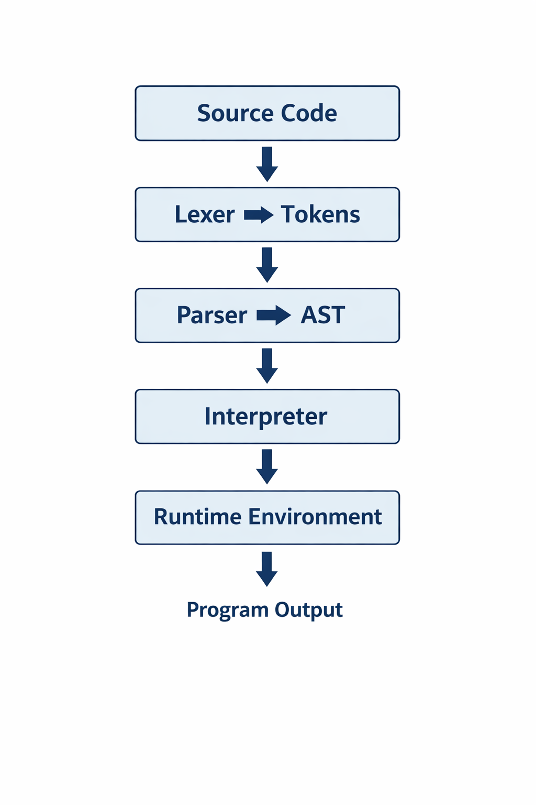

# Flux Programming Language

Flux is a **beginner-friendly, interpreter-based programming language**
built completely **from scratch** using core Java.  
It is designed to demonstrate how programming languages work internally,
from lexical analysis to runtime execution.

Flux focuses on **clarity, inspectability, and learning**, making it ideal
for students, beginners, and anyone curious about language design.



---

## ✨ Features

- Built entirely from scratch (no external frameworks)
- Lexer → Parser → AST → Interpreter pipeline
- Dynamic typing
- Variables and expressions
- Arrays with indexed access
- Dictionaries/Maps with key-value access
- Strings with methods (`len`, `substring`)
- Conditional statements (`if / else`)
- Loops (`while`, `for`) with `break` and `continue`
- Functions (named and anonymous/lambda)
- Classes and object-oriented programming
- Methods and `this` keyword
- Logical operators (`and`, `or`, `not`)
- Built-in functions (`len`, `type`, `range`)
- Graceful program termination (`exit`)
- Comments (`#`)
- Beginner-friendly error messages

---

## 🔍 Internal Power (WOW Features)

Flux exposes its internals through powerful tooling:

- **AST Printer** – visualize program structure  
- **Execution Trace Mode** – observe interpreter decisions step by step  
- **Environment Dump** – inspect runtime variables  
- **REPL** – interactive Read–Eval–Print Loop  

These features make Flux an excellent **educational language**.

---

## 📁 Project Structure

```
Flux/
├── src/
│ ├── lexer/
│ ├── parser/
│ ├── ast/
│ ├── interpreter/
│ ├── runtime/
│ └── Main.java
├── examples/
│ └── basics.flux
├── docs/
│ ├── architecture.md
│ ├── execution-flow.md
│ ├── syntax.md
│ ├── cli.md
│ ├── error-handling.md
│ └── design-decisions.md
├── flux.bat / flux.cmd
└── README.md
```

---

## 🚀 Getting Started

### Compile Flux

From the `src` directory:

```bash
javac Main.java lexer/*.java parser/*.java ast/*.java interpreter/*.java runtime/*.java
```

### ▶️ Running Flux Programs

From the project root:

```bash
.\flux run examples/basics.flux
```

---

## 🧰 Command-Line Interface (CLI)

Flux provides several CLI commands:

### Run a program

```bash
.\flux run program.flux
```

### View Abstract Syntax Tree

```bash
.\flux ast program.flux
```

### Execution Trace Mode

```bash
.\flux trace program.flux
```

### Runtime Environment Dump

```bash
.\flux env program.flux
```

### Start Interactive REPL

```bash
.\flux repl
```

---

## 🧪 Example Flux Program

```flux
class Counter {
    fun init() {
        this.value = 0
    }

    fun inc() {
        this.value = this.value + 1
        return this
    }
}

fun add(a, b) {
    return a + b
}

c = Counter()
c.inc().inc()
print "Count:", c.value

nums = range(1, 5)
sum = 0

for i = 0 to len(nums) - 1 {
    sum = add(sum, nums[i])
}

print "Sum:", sum

if sum > 10 and not (sum == 0) {
    print "Big sum"
}

# Maps and string methods
person = {"name": "Alice", "age": 30}
print person["name"]

greeting = "Hello, World!"
print greeting.len()
print greeting.substring(0, 5)
```

---

## 📘 Documentation

Detailed documentation is available in the `docs/` folder:

- [Architecture Overview](docs/architecture.md)
- [Execution Flow](docs/execution-flow.md)
- [Language Syntax](docs/syntax.md)
- [CLI Reference](docs/cli.md)
- [Error Handling](docs/error-handling.md)
- [Design Decisions](docs/design-decisions.md)

---

## 🎯 Design Goals

- Teach how interpreters work internally
- Keep syntax simple and readable
- Expose internal execution details
- Avoid unnecessary complexity
- Build everything from first principles

---

## 🧠 Learning Outcomes

Building Flux involved learning:

- Lexical analysis and tokenization
- Recursive descent parsing
- AST construction and traversal
- Interpreter design
- Runtime environment management
- Object-oriented features (classes, methods, inheritance-free)
- CLI tooling and REPL design

---

## 🏁 Conclusion
Flux is not just a toy language — it is a complete, inspectable interpreter
designed to demonstrate how programming languages work under the hood.
It serves as both a learning tool and a strong portfolio project.

Built with ❤️ to learn how languages really work.